# Custom Arduino Pinball Machine

**A fully assembled, SpongeBob-themed pinball machine combining embedded control, sensor interfacing, electromechanical actuators, and custom mechanical design.**

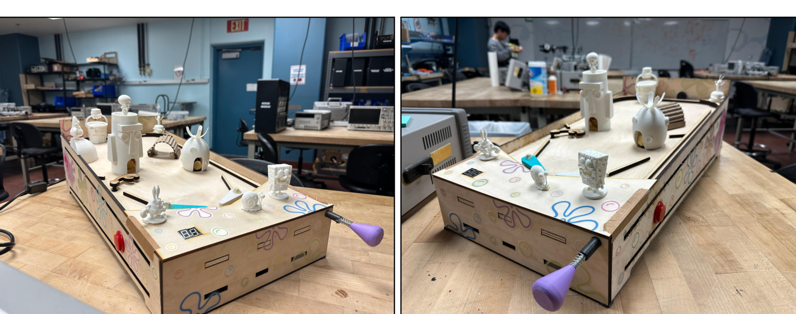

## Overview

Designed and built a tabletop pinball machine for **ECE 115**. The system uses an Arduino to coordinate player-controlled solenoid flippers, impact-based scoring, infrared ball detection, a servo-operated ball-return gate, animated obstacles, audio feedback, and a multiplexed two-digit score display. The playfield and mechanical assemblies were developed in **SolidWorks** and fabricated with plywood and 3D-printed components.

The project brings together **circuit design, embedded programming, mechanical CAD, fabrication, integration, and functional testing**.

## Features

| Subsystem | Implementation |
| --- | --- |
| Player controls | Two push buttons and solenoid-actuated flippers |
| Ball launching | Spring-loaded plunger |
| Scoring | Piezoelectric impact sensors inside character houses and an IR beam sensor at the Krusty Krab |
| Ball return | Optical drain detection and servo-driven gate mechanism |
| Moving obstacles | DC motor and RC servo mechanisms |
| Feedback | DFPlayer Mini audio playback and two multiplexed seven-segment displays |
| Controller | Arduino sketch implementing sensor processing, scoring, debouncing, and game-state logic |
| Mechanical design | SolidWorks assemblies, plywood structure, and printed figures |

## Finished Build

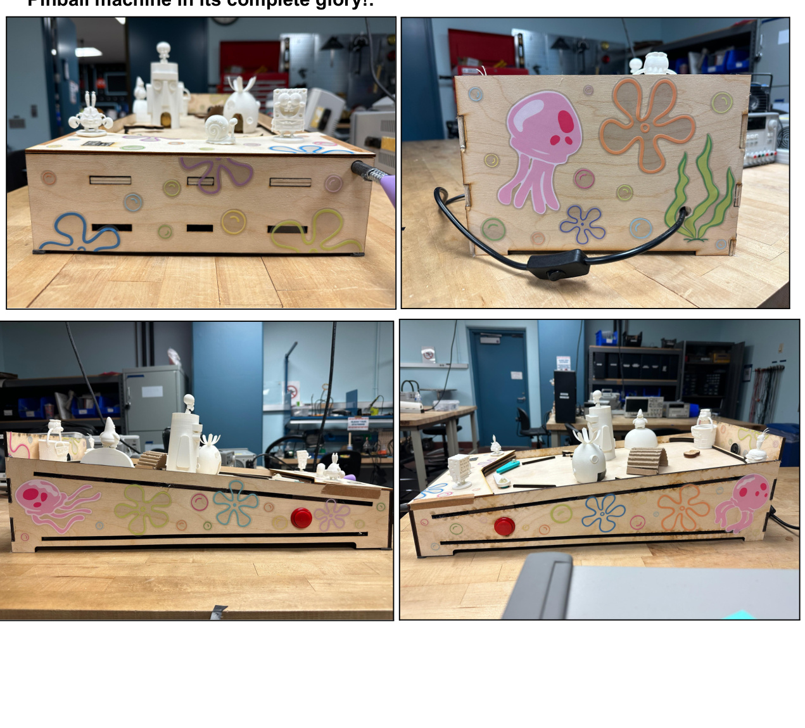

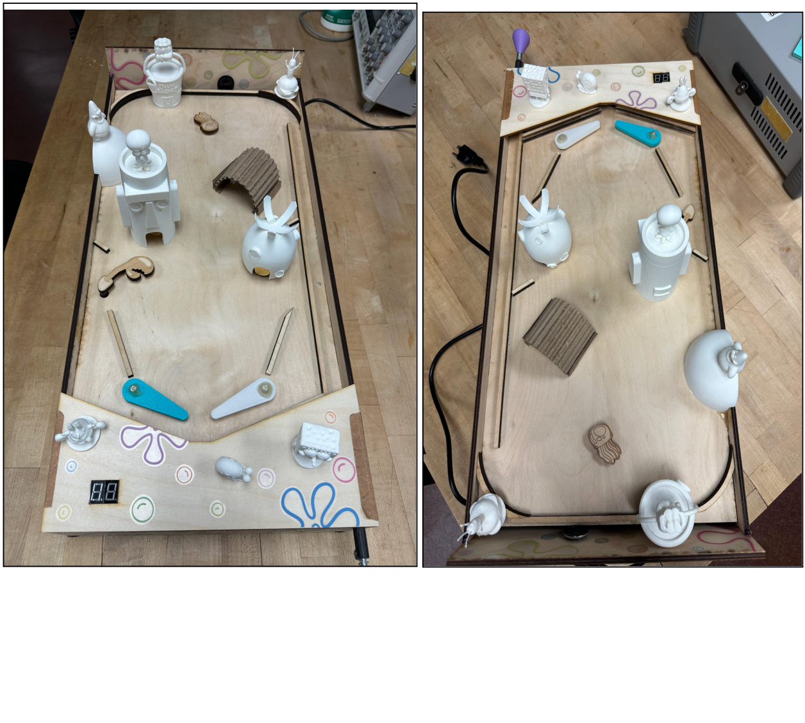

The sloped playfield uses flippers and themed obstacles to keep a launched ball in play. The design also includes a physical ball launcher, a gate for ball reloading, and an accessible electronics area underneath the playfield.

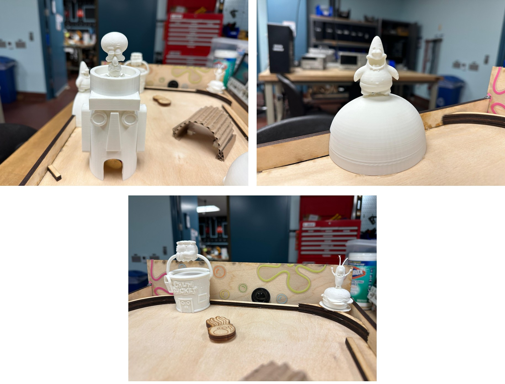

## Electrical and Embedded Design

The Arduino reads the **piezo** and **infrared** sensors to detect scoring events and ball movement. MOSFET driver stages switch the solenoids and motor, with flyback diodes used for inductive-load protection. The IR interface uses signal filtering and comparator hysteresis to help reject false triggers. A **DFPlayer Mini** provides audio cues, while the score is shown on two multiplexed seven-segment displays.

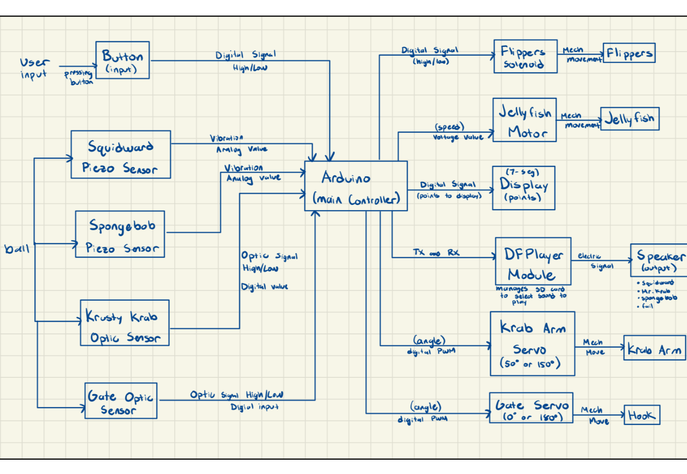

**Actuation circuits — DC motor and solenoid flippers**

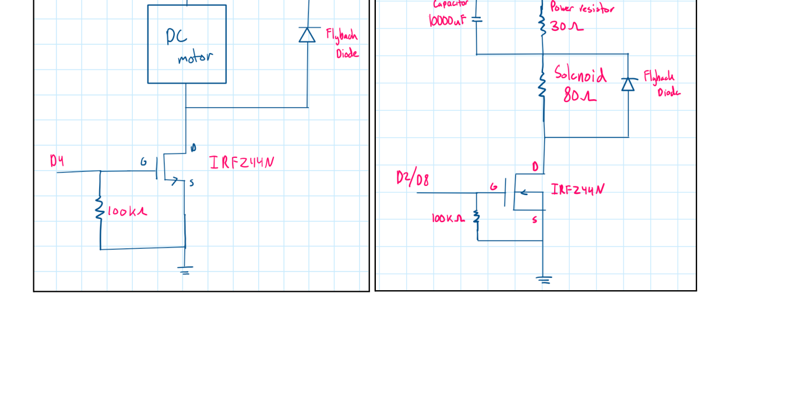

**Sensor, audio, and display interface diagrams**

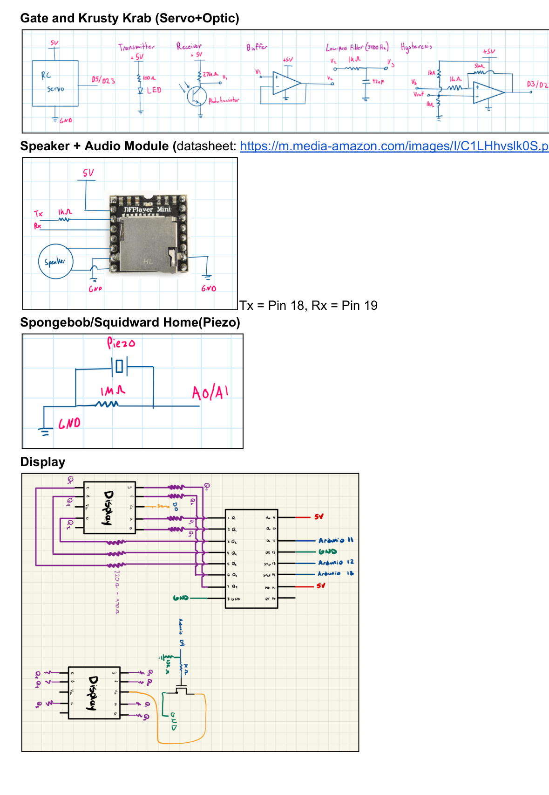

See the original [`firmware/Pinball_code.ino`](firmware/Pinball_code.ino) for control logic. The sketch depends on the Arduino `Servo` library and the `DFRobotDFPlayerMini` library; hardware-specific pin assignments are defined near the top of the file.

## Mechanical Design

The team modeled the playfield, flippers, ball launcher, and moving mechanisms in **SolidWorks** before constructing the plywood enclosure and assembling the printed figures. Native assembly and part files are preserved in [`mechanical/`](mechanical/).

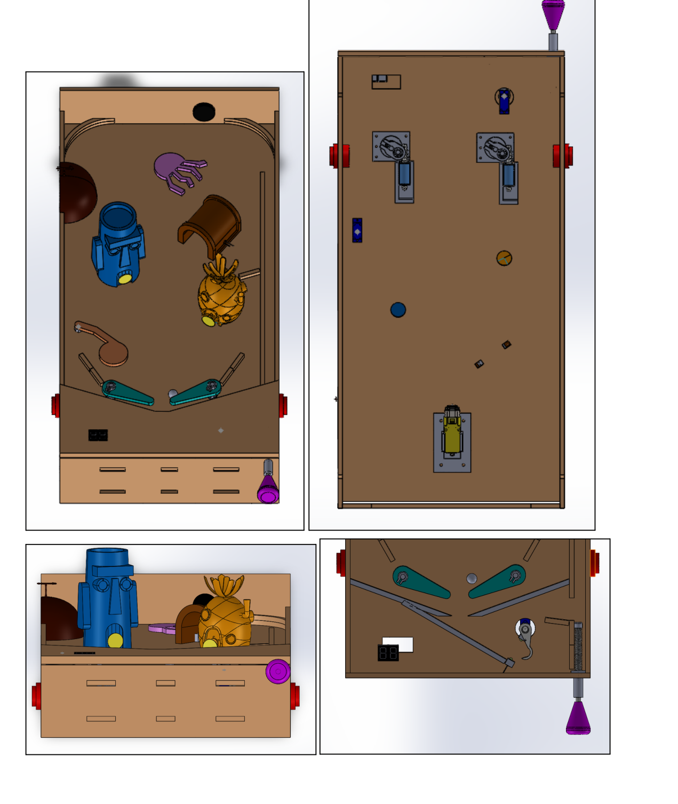

**Electronics mounted beneath the playfield**

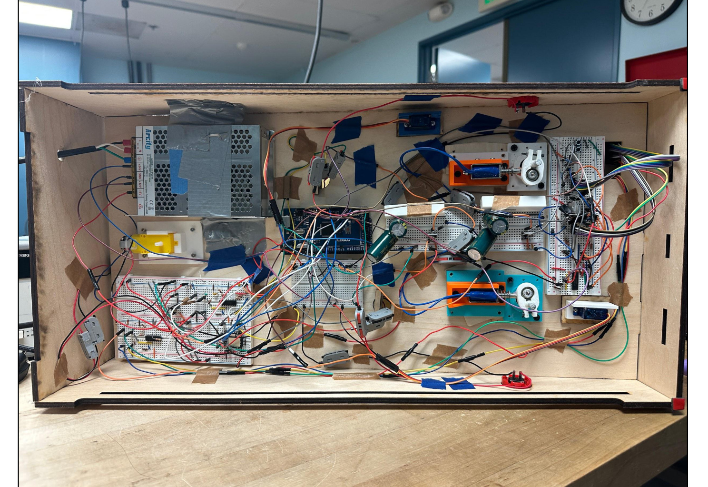

The electronics were attached to the underside of the playfield and enclosure sides rather than using separate breadboard mounts, keeping wiring shorter and the hardware accessible during integration.

## Game Control

The Arduino coordinates scoring, flipper movement, ball detection, and servo-based reloading through game-state logic. The report documents the high-level state-machine diagrams for the pinball machine, score display, flipper controls, and player flow.

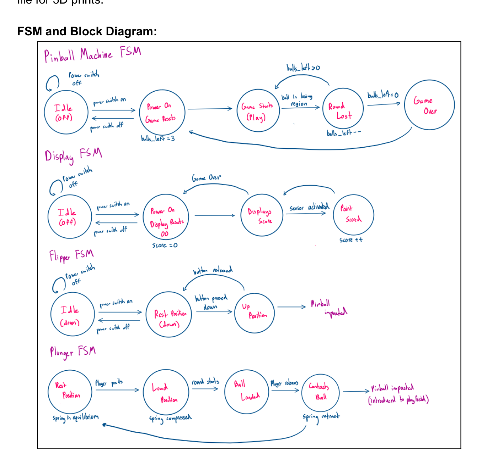

The optical and servo gate mechanism was also designed and evaluated as a dedicated subsystem.

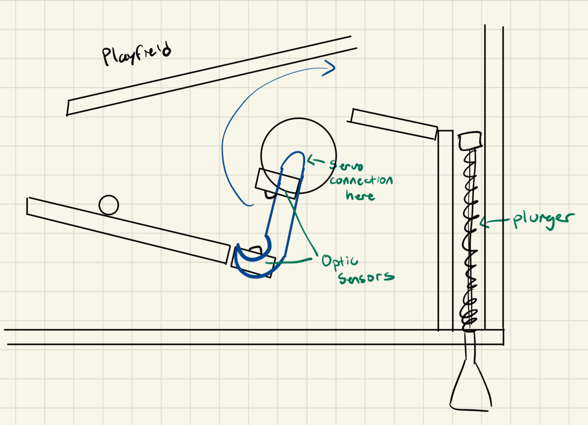

## Testing and Results

The final team report documents a **completed system evaluation**, including the following functional observations:

- **Scoring:** Impacts on the piezo-equipped houses updated the score. The Squidward sensor required more force than the SpongeBob sensor.
- **Ball return:** The gate successfully collected/reloaded a drained ball in the documented test.
- **Round handling:** The report records a three-cycle gate/round test.
- **Playfield design:** Added obstacles reduced immediate ball losses and extended rounds during playtesting.

These are qualitative functional results from the final report, not quantified reliability or performance benchmarks. See the [final report](documentation/final-report.pdf), especially its test matrix on **pages 5–6**.

## Project Files

```text
custom-pinball-machine/
├── README.md
├── images/             # Selected photographs and figures from the final PDF
├── firmware/           # Original Arduino sketch
├── mechanical/         # SolidWorks assemblies and part files
│   └── printed-figures/# Original 3MF assets (check third-party licensing)
└── documentation/      # Original 13-page final report
```

**Image sources:** Finished-machine and playfield photos are from report **pages 6–7**; close-up figures from **page 2**; underside wiring from **page 3**; CAD from **page 8**; FSM diagrams from **page 9**; electrical diagrams and system overview from **pages 10–11**; and gate mechanism diagrams from **page 5**. The images are included separately for easier viewing on GitHub.

## Contributors

**Maddux Madayag and Eric Zheng** — ECE 115 team project.

## Notes

- The firmware is preserved as provided. It was designed for the team's original controller, pinout, wiring, and audio assets; this repository is **not** a plug-and-play kit.
- The **sound files are not included**, and hardware-specific libraries and dependencies must be installed separately.
- The `.SLDPRT` / `.SLDASM` files may require SolidWorks or compatible software, and all their referenced components must be available for assemblies to resolve.
- Some themed `.3mf` figures may have external authors or separate licenses; verify permissions and attribution before public reuse.
